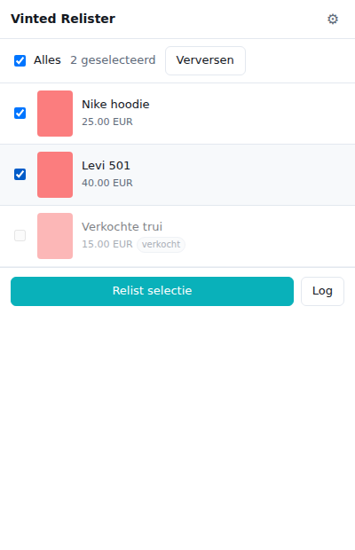
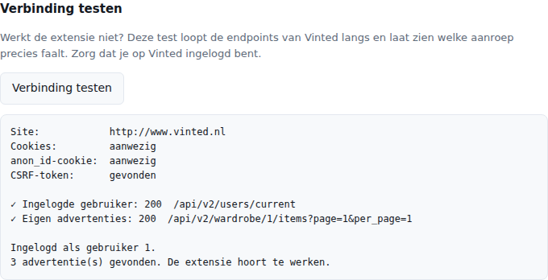

# Vinted Relister

Browser-extensie waarmee je je eigen Vinted-advertenties opnieuw plaatst. Per item worden
de gegevens en foto's gekopieerd naar een nieuwe advertentie; daarna wordt de oude
verwijderd. Het resultaat is hetzelfde als handmatig relisten — je item staat weer
bovenaan in de zoekresultaten — maar dan zonder dat je alles opnieuw hoeft in te typen.



## Installeren

De extensie is niet in de Chrome Web Store gepubliceerd, dus je laadt hem zelf in
(werkt in Chrome, Edge, Brave en Opera):

1. Download of clone deze map.
2. Ga naar `chrome://extensions`.
3. Zet **Ontwikkelaarsmodus** rechtsboven aan.
4. Klik **Uitgepakte extensie laden** en kies deze map.

Voor Firefox is een aparte build nodig; die zit er nu niet in.

## Gebruiken

1. Log in op Vinted en houd dat tabblad open.
2. Klik op het extensie-icoon. Je advertenties verschijnen in de lijst.
3. Vink aan wat je wilt relisten en klik **Relist selectie**.
4. Bevestig. De voortgang zie je in de popup; via **Log** zie je wat er per item gebeurt.

Je mag de popup sluiten — de sessie loopt door in het Vinted-tabblad. Sluit dat tabblad
niet tijdens een sessie.

**Begin met testmodus.** Zet bij instellingen *Testmodus* aan: de extensie doorloopt dan
alles (gegevens ophalen, controleren, payload opbouwen) maar maakt niets aan en verwijdert
niets. Zo zie je of alles klopt voordat je het echt doet.

## Instellingen

| Instelling | Wat het doet |
| --- | --- |
| **Volgorde** | `Eerst plaatsen, dan verwijderen` (standaard) houdt je advertentie online als het uploaden misgaat. `Eerst verwijderen` doet het andersom; het item staat dan heel even offline. |
| **Testmodus** | Alles doorlopen zonder iets te wijzigen. |
| **Pauze tussen items** | Standaard 45 s plus 0–20 s willekeurig. Rustig aan werkt betrouwbaarder. |
| **Maximaal aantal per sessie** | Harde bovengrens per run, standaard 10. |
| **Prijs** | Ongewijzigd overnemen, of met een percentage/bedrag aanpassen (met minimumprijs als ondergrens). |
| **Alleen items ouder dan** | Sla advertenties over die je net hebt geplaatst. |
| **Automatisch relisten** | Relist periodiek zelf je oudste advertenties. |
| **Back-ups** | Slaat de itemgegevens lokaal op vlak vóór het verwijderen. |

## Hoe het werkt

De extensie gebruikt dezelfde interne endpoints als de Vinted-website zelf. Alle
verzoeken lopen via een content script op de Vinted-pagina, dus je normale sessiecookies
gelden en er wordt niets aan inloggegevens gelezen, opgeslagen of verstuurd. Per item:

```
gegevens ophalen  →  controleren  →  foto's downloaden en opnieuw uploaden
                  →  nieuwe advertentie aanmaken  →  oude verwijderen
```

Overgenomen worden: titel, beschrijving, prijs, categorie, merk, maat, staat, kleuren,
pakketgrootte, afmetingen, extra kenmerken en alle foto's in dezelfde volgorde.

Overgeslagen worden: verkochte items, concepten, items zonder foto's of categorie, en —
als je dat aanzet — gereserveerde items.

Zie [`docs/vinted-api.md`](docs/vinted-api.md) voor de gebruikte endpoints.

## Als er iets misgaat

Begin bij **tandwiel → Verbinding testen**. Die loopt de leesroutes van Vinted stuk voor
stuk langs en laat per aanroep zien wat er terugkomt, plus of je cookies, het CSRF-token
en de `anon_id` aanwezig zijn. Zo hoef je niet te gokken welke stap faalt.



| Wat je ziet | Wat het betekent |
| --- | --- |
| `Cookies: GEEN` | Je bent op díe Vinted-site niet ingelogd. Let op het domein bovenaan het rapport — ingelogd zijn op vinted.be helpt niet als de extensie vinted.nl opent. |
| Alle regels `✗ … 401` of `403` | De endpoints zijn waarschijnlijk gewijzigd. Kijk bij **Waargenomen endpoints** welke paden de site zelf gebruikt. |
| Een enkele regel met `✗ … 401` of `403` | Vinted weigert die specifieke aanroep. Ververs de Vinted-pagina en probeer opnieuw; blijft het, dan is het endpoint waarschijnlijk gewijzigd — zie [`docs/vinted-api.md`](docs/vinted-api.md). |
| "Vinted weigerde de gegevens (422)" | Er ontbreekt een veld voor de nieuwe advertentie. De log noemt meestal de reden. |
| "Te veel verzoeken (429)" | Te snel achter elkaar. Stop, wacht een uur en zet de pauzes hoger. |
| "Nieuwe advertentie X staat online, maar het verwijderen van Y mislukte" | Je hebt hetzelfde item nu twee keer online. Verwijder de oude handmatig op Vinted. |
| "Tabblad gesloten" | De sessie is afgebroken. Kijk op Vinted wat wel en niet gelukt is voordat je opnieuw start. |

Ging er iets halverwege mis? **Exporteren als JSON** bij de back-ups geeft je de gegevens
van de items die al verwijderd waren.

### Waargenomen endpoints

Vinted heeft geen openbare API, dus de paden die deze extensie gebruikt kunnen verouderen.
De extensie neemt daarom op welke API-paden de site zélf aanroept. Open Vinted, ga naar je
eigen profiel — de pagina waar je advertenties staan — ververs die met F5, en kijk bij
**instellingen → Waargenomen endpoints**.
Verversen is precies wat de recorder activeert.

Alleen de methode, het pad, de namen van de queryparameters en de statuscode worden
bewaard — geen inhoud, headers of cookies.

## Belangrijk om te weten

- **Relisten wist je statistieken.** De oude advertentie verdwijnt, en daarmee ook de
  likes, de views en eventuele vragen eronder. Dat is inherent aan relisten, niet aan
  deze extensie.
- **Vinted heeft hier geen officiële API voor.** De extensie leunt op de interne
  endpoints van de website. Als Vinted die aanpast, kan een stap stukgaan. Draai dan
  eerst met testmodus aan en kijk in de log welke stap faalt.
- **Ga rustig te werk.** Grote aantallen in hoog tempo kunnen door Vinted als
  geautomatiseerd misbruik worden gezien. De standaardpauzes zijn daar bewust op
  ingesteld; zet ze niet zomaar op nul. Controleer zelf even of dit past binnen de
  gebruiksvoorwaarden van Vinted voor jouw account.
- **Alles blijft lokaal.** Instellingen en back-ups staan in de opslag van je browser.
  Er gaat niets naar een server van derden.

## Ontwikkelen

```bash
npm run validate    # paden, imports en element-id's in het manifest en de HTML
npm test            # unit tests van de mapping-, prijs- en batchlogica
npm run test:e2e    # laadt de extensie echt in Chromium tegen een nep-Vinted-server
npm run check       # alle drie
npm run icons       # icons opnieuw genereren
npm run package     # zip voor distributie
```

De e2e-test heeft Playwright nodig (`npm install`). Hij start een lokale server die de
Vinted-API nabootst, laat Chromium `www.vinted.nl` daarheen wijzen, laadt de extensie en
doet een volledige relist via de echte popup-interface.

```
src/lib/        gedeelde logica (API-client, mapping, planning) — zonder chrome.* waar mogelijk
src/content/    draait op vinted.*, voert alle API-verzoeken uit
src/background/ service worker: run-status, tabbeheer, geplande sessies
src/popup/      selectielijst en voortgang
src/options/    instellingen en back-ups
```

## Licentie

MIT
